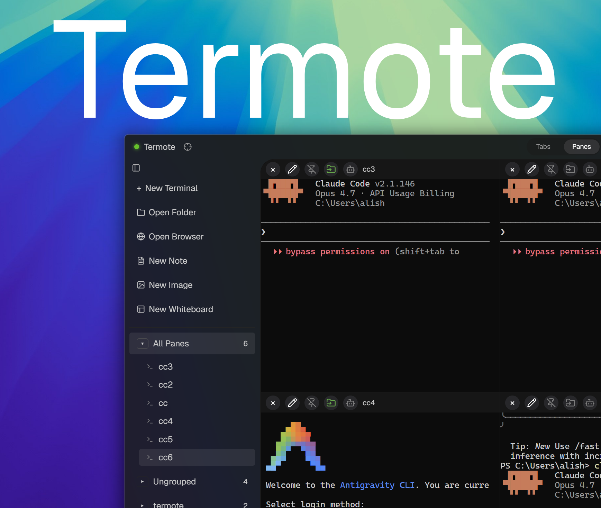
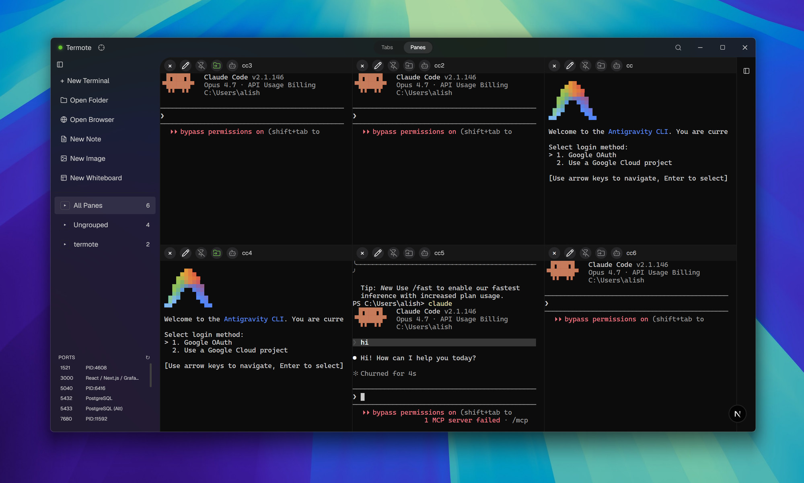
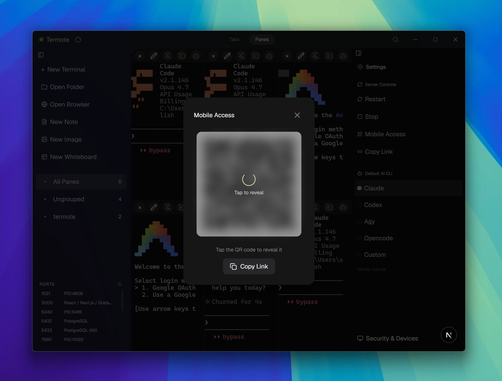
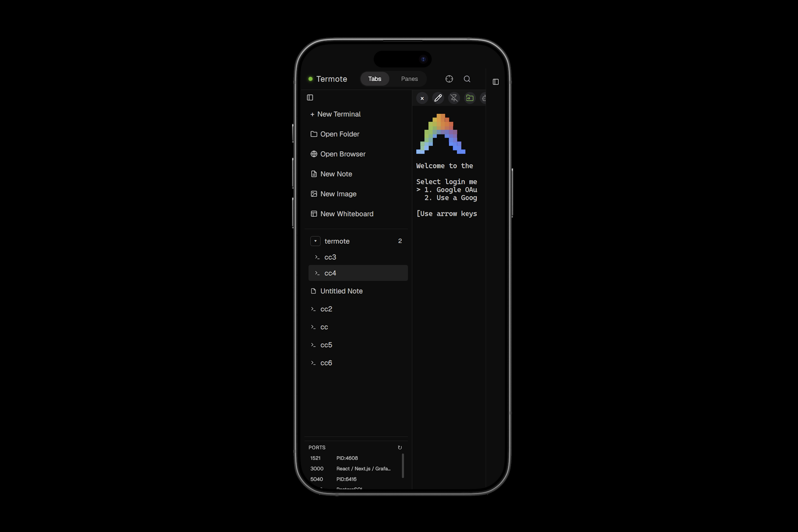
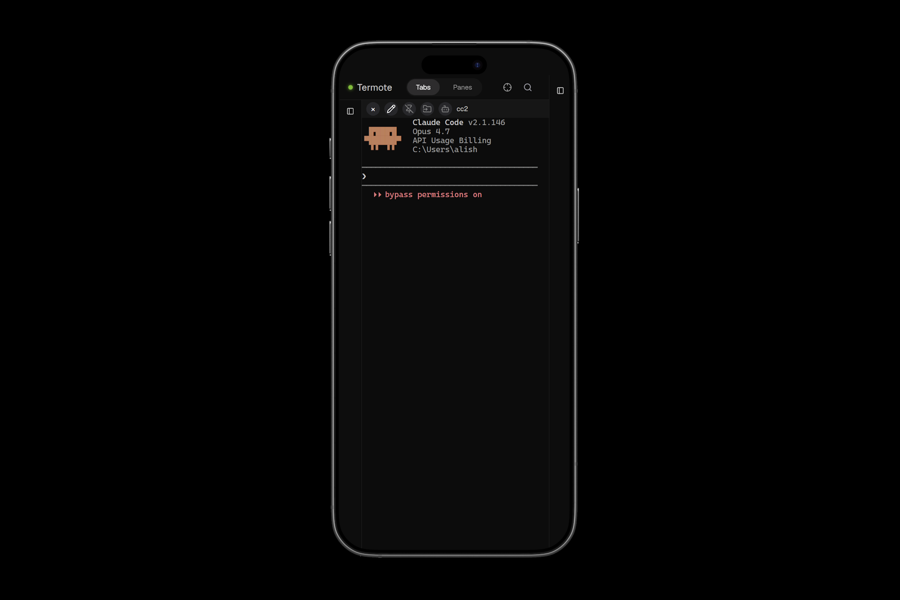

# Termote - Terminal Backend

<div align="center">


**Termote is a Rust-based lightweight Agentic Development Environment (ADE) that boosts your productivity with a persistent multi-pane workspace, built-in tools, and one-click remote access so you can keep working from your phone, anywhere.**

</div>

---

## Quick Install

**This is the backend only.** For the full app with GUI, download the installer:

👉 **[Termote Releases](https://github.com/AliSharjeell/Termote/releases)**

The installer packages everything together — one download, one install.

---

## What is This?

The **Termote backend** is a Rust server that:

- Manages terminal (PTY) processes
- Serves terminal data over WebSocket
- Handles multi-client connections and state sync
- Integrates with Microsoft Dev Tunnels for remote access

It's bundled with the desktop app. **Download from [Termote Releases](https://github.com/AliSharjeell/Termote/releases)** instead of installing this directly.



---

## Mobile Access

Scan the QR code to connect from your phone or tablet — no VPN needed.



---





---

## Technical Stack

| Component | Library |
|-----------|---------|
| HTTP/WebSocket | axum |
| Async runtime | tokio |
| PTY management | portable-pty |
| Logging | tracing + tracing-appender |
| Serialization | serde |

---

## Architecture

The backend runs as a sidecar alongside the frontend app:

```
┌──────────────────────────────────────┐
│         Termote Desktop App          │
│                                      │
│  ┌────────────┐     ┌─────────────┐  │
│  │  Frontend  │────▶│   Backend   │  │
│  │  (Next.js) │◀────│   (Rust)    │  │
│  └────────────┘ WS  └─────────────┘  │
│                        │             │
│                        ▼             │
│                   [PTY Processes]     │
└──────────────────────────────────────┘
```

**Ports:**
- `9090` — HTTP/WebSocket server
- `9091` — IPC for single-instance communication

---

## Building

```bash
# Build release
cargo build --release

# Binary output
# target/release/termote-backend
```

Or build via Termote:
```bash
cd ../Termote
npm run tauri:build
```

---

## IPC Commands

The backend accepts commands on port 9091:

| Command | Action |
|---------|--------|
| `open_dir:<path>` | Spawn new terminal in directory |
| `ban:<ip>` | Ban an IP address |
| `unban:<ip>` | Remove IP from ban list |
| `ban-list` | List all banned IPs |

---

## Logging

Logs are written to:
- `%TEMP%/termote.log` (rotated daily)
- stdout in debug builds

---

## Contributing

1. Open an Issue or email `alisharjeelofficial@gmail.com`
2. Get assigned before writing code
3. Open a PR with tests

---

## License

MIT License
---

## Disclaimer ⚠️

**This is pre-alpha software.** Development is ongoing and features may change.

**Known limitations:**
- **macOS & Linux builds** — Not fully tested. Contributions welcome!
- **Browser panes** — Experimental, not fully functional.
- **Whiteboard panes** — Experimental, needs refinement.

If you'd like to contribute to testing or development, please open an issue or reach out at `alisharjeelofficial@gmail.com`.
